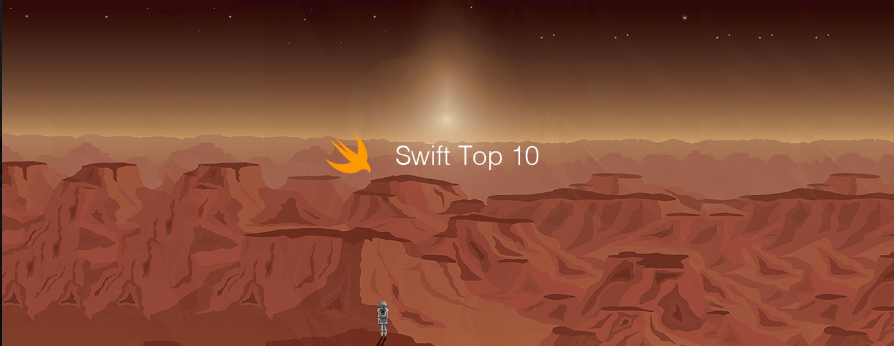

# Swift Top 10 Articles for the Past Month (v.Jul 2018)

</a>

For the past month, we ranked nearly 900 Swift articles to pick the Top 10 stories that can help advance your career (1.1% chance).
 
* Topics in this list: TableView, Design Patterns, Code Duplication, Xcode 10, UITabBarController, ML Tutorial, Vision, Playgrounds, Result types, Diagnostics
* Also published on [Medium](https://goo.gl/AwV1HE)

 

#### Course of the month:

[A) Beginners: iOS 11 & Swift 4 — The Complete iOS App Development Bootcamp.](http://bit.ly/2qWHy1Y) [21,559 recommends, 4.7/5 stars]

[B) CoreML — Master Machine Learning for iOS Apps.](http://bit.ly/2J9qSbf) [139 recommends, 4.7/5 stars]

 

## Rank 1
### [Enum-Driven TableView Development](https://www.raywenderlich.com/188692/enum-driven-tableview-development?utm_source=mybridge&utm_medium=blog&utm_campaign=read_more)

 

## Rank 2
### [Real World: iOS Design Patterns](https://medium.com/cocoaacademymag/real-world-ios-design-patterns-3e5aad172094?utm_source=mybridge&utm_medium=blog&utm_campaign=read_more)

 

## Rank 3
### [Advanced Swift Generics: Best Solution to Eliminate Code Duplication!](https://www.youtube.com/watch?v=lpTNaBUFkno?utm_source=mybridge&utm_medium=blog&utm_campaign=read_more)

 

## Rank 4
### [What’s new in Xcode 10?](https://medium.com/developerinsider/whats-new-in-xcode-10-fddeab035d05?utm_source=mybridge&utm_medium=blog&utm_campaign=read_more)

 

## Rank 5
### [Creating a UITabBarController Framework](https://medium.com/flawless-app-stories/creating-a-uitabbarcontroller-framework-8bd7b1289244?utm_source=mybridge&utm_medium=blog&utm_campaign=read_more)

 

## Rank 6
### [Create ML Tutorial: Getting Started](https://www.raywenderlich.com/196233/create-ml-tutorial-getting-started?utm_source=mybridge&utm_medium=blog&utm_campaign=read_more)

 

## Rank 7
### [Vision in iOS: Text detection and Tesseract recognition](https://medium.com/flawless-app-stories/vision-in-ios-text-detection-and-tesseract-recognition-26bbcd735d8f?utm_source=mybridge&utm_medium=blog&utm_campaign=read_more)

 

## Rank 8
### [Create Your Own Swift Playgrounds Subscription - Apple WWDC 2018](https://www.youtube.com/watch?v=TVl0AOR33jA?utm_source=mybridge&utm_medium=blog&utm_campaign=read_more)

 

## Rank 9
### [The power of Result types in Swift](https://www.swiftbysundell.com/posts/the-power-of-result-types-in-swift?utm_source=mybridge&utm_medium=blog&utm_campaign=read_more)

 

## Rank 10
### [Swift Diagnostics: #warning and #error](https://swiftunboxed.com/internals/diagnostics-warning-error?utm_source=mybridge&utm_medium=blog&utm_campaign=read_more)
